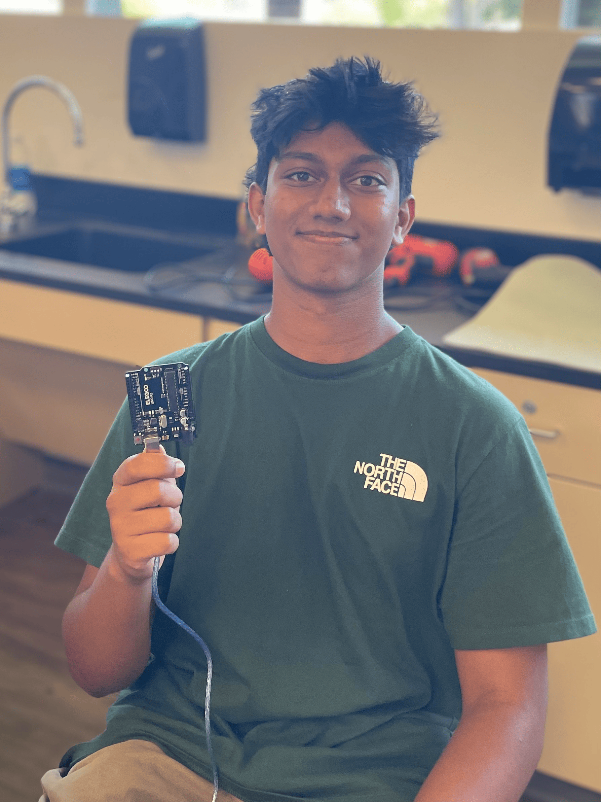
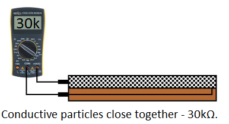
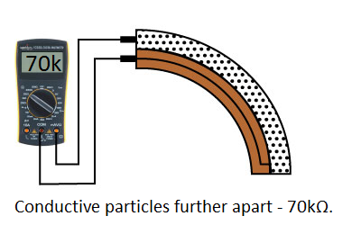
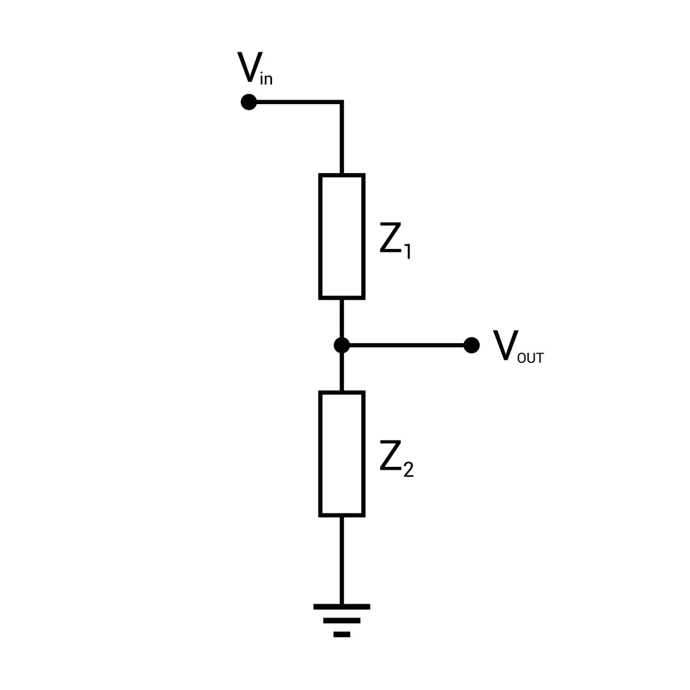
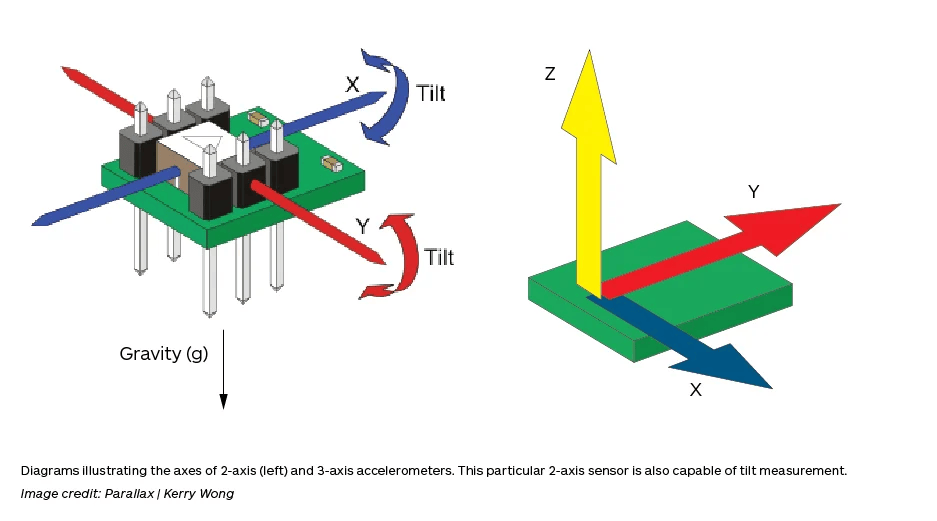
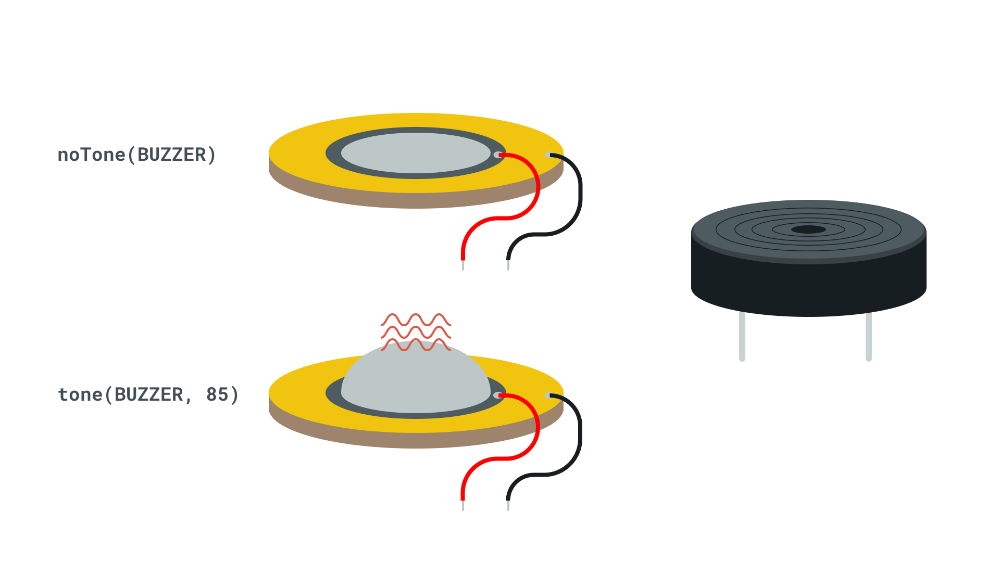
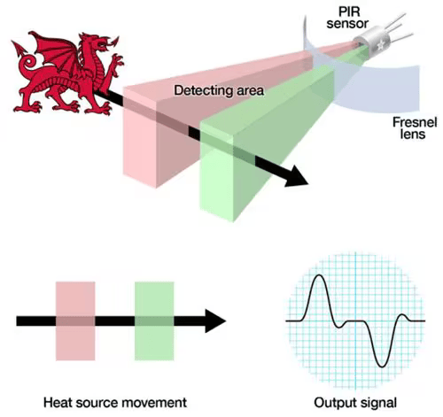
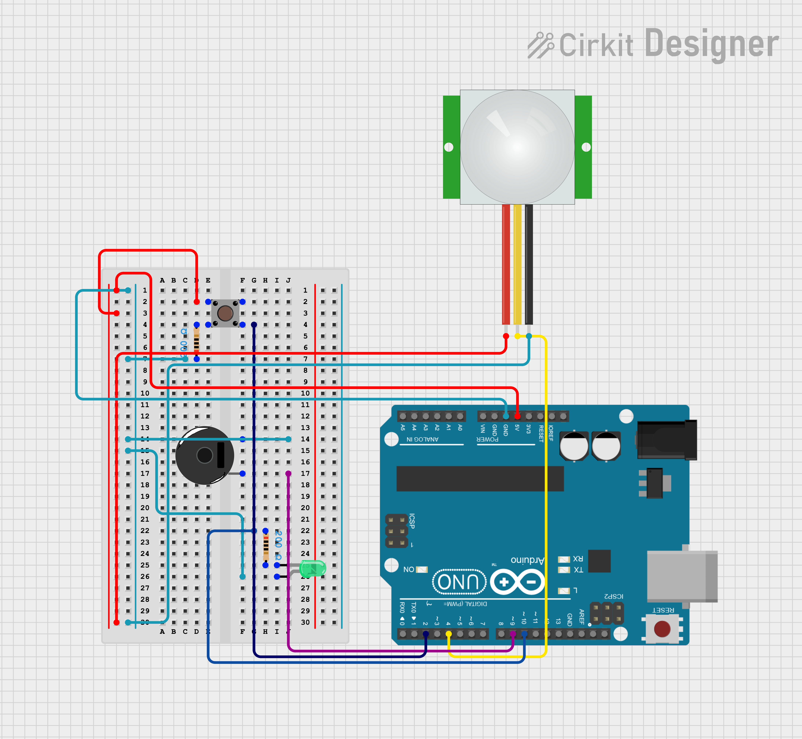
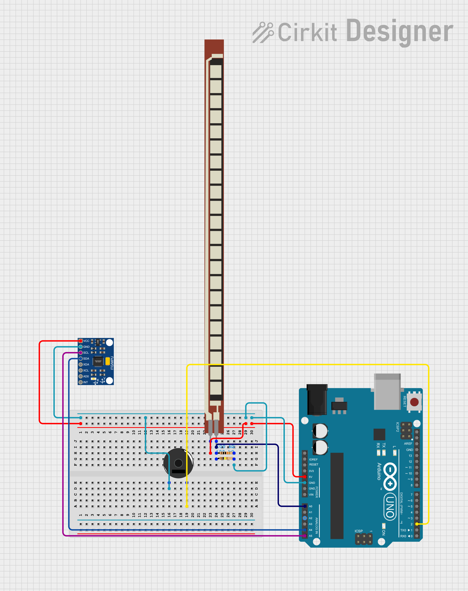

# Knee Rehab Monitor

<!---
Replace this text with a brief description (2-3 sentences) of your project. This description should draw the reader in and make them interested in what you've built. You can include what the biggest challenges, takeaways, and triumphs from completing the project were. As you complete your portfolio, remember your audience is less familiar than you are with all that your project entails!

You should comment out all portions of your portfolio that you have not completed yet, as well as any instructions:
-->

<!--- This is an HTML comment in Markdown -->
<!--- Anything between these symbols will not render on the published site -->


| **Engineer** | **School** | **Area of Interest** | **Grade** |
|:--:|:--:|:--:|:--:|
| Arjun V | Las Lomas High School | Mechanical Engineering | Incoming Junior

<!---**Replace the BlueStamp logo below with an image of yourself and your completed project. Follow the guide [here](https://tomcam.github.io/least-github-pages/adding-images-github-pages-site.html) if you need help.**-->


  
<!---# Final Milestone

**Don't forget to replace the text below with the embedding for your milestone video. Go to Youtube, click Share -> Embed, and copy and paste the code to replace what's below.**

<iframe width="560" height="315" src="https://www.youtube.com/embed/F7M7imOVGug" title="YouTube video player" frameborder="0" allow="accelerometer; autoplay; clipboard-write; encrypted-media; gyroscope; picture-in-picture; web-share" allowfullscreen></iframe>

For your final milestone, explain the outcome of your project. Key details to include are:
- What you've accomplished since your previous milestone
- What your biggest challenges and triumphs were at BSE
- A summary of key topics you learned about
- What you hope to learn in the future after everything you've learned at BSE


# Second Milestone

<!---**Don't forget to replace the text below with the embedding for your milestone video. Go to Youtube, click Share -> Embed, and copy and paste the code to replace what's below.**

<iframe width="560" height="315" src="https://www.youtube.com/embed/y3VAmNlER5Y" title="YouTube video player" frameborder="0" allow="accelerometer; autoplay; clipboard-write; encrypted-media; gyroscope; picture-in-picture; web-share" allowfullscreen></iframe>

For your second milestone, explain what you've worked on since your previous milestone. You can highlight:
- Technical details of what you've accomplished and how they contribute to the final goal
- What has been surprising about the project so far
- Previous challenges you faced that you overcame
- What needs to be completed before your final milestone-->

# First Milestone

<iframe width="560" height="315" src="https://www.youtube.com/embed/Q6NsCcsk8Xg?si=JDRZV4ocUAxqacnu" title="YouTube video player" frameborder="0" allow="accelerometer; autoplay; clipboard-write; encrypted-media; gyroscope; picture-in-picture; web-share" referrerpolicy="strict-origin-when-cross-origin" allowfullscreen></iframe>

<p></p>My first milestone was to detect position using a flex sensor and accelerometer. My first step was to create a circuit with a flex sensor and two resistors. First, I looked at a 
<a href="https://learn.sparkfun.com/tutorials/flex-sensor-hookup-guide/all">schematic</a>
that called for a 47k resistor, and a 50k resistor was the closest round number to 47k. As there were no 50k resistors, I learned about resistors wired in parallel to fix this issue. Since the current has more ways to flow through the circuit, there is less resistance overall. Due to this, I ended up putting two 100k resistors in parallel to each other to fix this, because when you put the two resistors in the parallel resistor formula (1/Rt = 1/R1 + 1/R2), the total resistance of the two ends up being 50k. 
<p></p>After resolving my resistor issue, I had to learn how flex sensors work. I learned that the flex sensor has ink that has conductive particles in it, and the more the sensor bends the more resistance is measured across it.
 


<p></p><i>Figure 1; <a href="https://learn.sparkfun.com/tutorials/flex-sensor-hookup-guide/all">Spark Fun, Flex Sensor Hookup Guide</a> - This graphic describes how a flex sensor has more resistance when it is bent.</i>

<p></p>The flex sensor is essentially a variable resistor. When we put it in a voltage divider circuit, we can use the resistance that the flex sensor gives, put the resistance into ohms law and find the voltage of it, which is something the Arduino can actually read. For example, if we take the formula V<sub>out=R2<sup>R1</sup>&frasl;<sub>R2</sub>ub>, and say the flex sensor is R2, if the resistance of it increases so does the Vo (Voltage Out). Therefore, if the flex sensor bends more and the resistance increases, so does the voltage out which the arduino reads.


<i><p>Figure 3; <a href="https://resources.pcb.cadence.com/blog/voltage-dividers-operations-and-functions">Voltage Dividers: Operations and Functions</a> - This is a voltage divider circuit. For my project, Z2 would be the Flex sensor and Z1 would be the parallel resistors I talked about earlier.</i>

<p></p>This can be interpreted into the degrees the sensor is bending with some code. In the code, the flex sensor gives a value of 0 - 1023, then it is normalized. I calibrated the resistance for 0 degrees and 90 degrees, with STRAIGHT_RESISTANCE (0 degrees) being 13304.4 ohms and BEND_RESISTANCE (90 degrees) being 31319.56 using the map() function in the arduino IDE. The function extrapolates the degree value to a different bend. Also, the flex sensor also can only be plugged into analog instead of digital because it has multiple values. When the sensor bends past 110 degrees, the buzzer goes off, which is the most your knees should bend when squatting.

<p></p>Next, added the Accelerometer. I found a way to display the position of the accelerometer on the Print Monitor of the Arduino IDE using the Serial Print function. After some research, I found the code and put that into the Arduino sketch with flex sensor code. Next, I wired the accelerometer to the Arduino.



<p></p>Figure 2; <a href="https://insights.globalspec.com/article/1263/specifying-an-accelerometer-function-and-applications">GlobalSpec, Specifying an Accelerometer: Function and Applications</a> -  This is how a accelerometer works.

<p></p>Some challenges I had were that I had to learn about parallel resistors to solve my resistor issue. This concept took me two days to grasp, but once I learned it it made my understanding of the circuit much better. I also had to learn how to get data from an accelerometer. I had no idea how to code this, but I was able to find some code online which made adding to my code much easier.
Up next is my second milestone. I plan on attaching the bluetooth module, so I can track the data from the accelerometer and flex sensor much easier.


# Starter Project

<iframe width="560" height="315" src="https://www.youtube.com/embed/Xf_h2ZlMCag?si=Pgq-o5lSrfOtKBD6" title="YouTube video player" frameborder="0" allow="accelerometer; autoplay; clipboard-write; encrypted-media; gyroscope; picture-in-picture; web-share" referrerpolicy="strict-origin-when-cross-origin" allowfullscreen></iframe>

<p></p>My starter project is a microcontroller-based Arduino project. It buzzes when I press a button and an LED goes off when it detects motion.    
<p></p>There are 5 main components in this project. The parts consist of the Arduino itself, a button, a piezo buzzer, a green LED and a PIR motion sensor. The first input and output is the button and the piezo buzzer. The piezo buzzer works by applying voltage to a piezoelectric ceramic material. The voltage causes the material to deform and vibrate, making sound waves.


<i>Figure 1</i> ; Photo from Arduino Sensor Kit - The image shows how the buzzer vibrates to produce a tone

<p></p>The button makes the piezo buzzer buzz at a tone of about 50 hz by closing the circuit and allowing the current to flow to the buzzer. 
<p></p>The second input and output are the PIR, or Passive Infrared motion sensor and the LED, or Light Emitting Diodes. A PIR sensor detects infrared radiation. It does this by sensing a heat source’s movements, which cause a pulse which the PIR sensor sends as a signal. When the sensor detects the heat source moving, the Arduino reads it and tells the LED to turn off. The Arduino can have code uploaded to it, and that tells the microcontroller what to do.


<i><p>Figure 2</i> ; Photo from Adafruit, Lady Ada - The image shows how the signal is generated. The heat sources passes through the detecting area and the PIR sensor registers that.

<p></p>I had a few major challenges, with the biggest one being the difficulty of uploading my code to the Arduino. The port for the Arduino would not show up on the Arduino software. Therefore I could not upload my fixed code. I tried many things to troubleshoot this issue. For example, I tried pressing the reset button on Arduino, removing and reinstalling the software, and even testing the cable and the USB-C adapter, but the issue ended up being more simple. After rewiring the board, I got it working again.
<p></p>Next, I will be working on my main project, the Knee Rehabilitation Monitor. The starter project gave me a good understanding of wiring, coding, and breadboards, so I am looking forward to my main project with this knowledge. The reason I chose my main project is because it looked like a helpful device for people with frequent knee injuries, like athletes or the elderly, and I think making something like the knee rehab monitor will help me find and make other ways to help in the future.

# Starter Project Schematics 



# Schematics 
<i>Figure 4</i>; Milestone 1 Schematic - 


# Code
```c++
#include <MPU6050.h>
#include <Wire.h>
#include <I2Cdev.h>

MPU6050 mpu;
int16_t ax, ay, az;
int16_t gx, gy, gz;

struct MyData {
  byte X;
  byte Y;
  byte Z;
};

MyData data;


const int FLEX_PIN = A0; // Pin connected to voltage divider output
const int buzzerPin = 2;
// Measure the voltage at 5V and the actual resistance of your
// 47k resistor, and enter them below:
const float VCC = 4.98; // Measured voltage of Ardunio 5V line
const float R_DIV = 50000.0; // Measured resistance of 3.3k resistor

// Upload the code, then try to adjust these values to more
// accurately calculate bend degree.
const float STRAIGHT_RESISTANCE = 13304.4; // resistance when straight
const float BEND_RESISTANCE = 31319.56; // resistance at 90 deg

void setup() 
{
  Serial.begin(9600);
  pinMode(FLEX_PIN, INPUT);
  pinMode(buzzerPin, OUTPUT);

  Serial.begin(9600);
  Wire.begin();
  mpu.initialize();
  //pinMode(LED_BUILTIN, OUTPUT);
}

void loop() 
{
  // Read the ADC, and calculate voltage and resistance from it
  int flexADC = analogRead(FLEX_PIN);
  float flexV = flexADC * VCC / 1023.0;
  float flexR = R_DIV * (VCC / flexV - 1.0);
  Serial.println("Resistance: " + String(flexR) + " ohms");

  // Use the calculated resistance to estimate the sensor's
  // bend angle:
  float angle = map(flexR, STRAIGHT_RESISTANCE, BEND_RESISTANCE,
                   0, 90.0);
  Serial.println("Bend: " + String(angle) + " degrees");
  Serial.println();

  delay(500);

  if (angle >= 110) {
  tone(buzzerPin,50);
  } else {
    noTone(buzzerPin);
  }
  mpu.getMotion6(&ax, &ay, &az, &gx, &gy, &gz);
  data.X = map(ax, -17000, 17000, 0, 255 ); // X axis data
  data.Y = map(ay, -17000, 17000, 0, 255); 
  data.Z = map(az, -17000, 17000, 0, 255);  // Y axis data
  delay(500);
  Serial.print("Axis X = ");
  Serial.print(data.X);
  Serial.print("  ");
  Serial.print("Axis Y = ");
  Serial.print(data.Y);
  Serial.print("  ");
  Serial.print("Axis Z  = ");
  Serial.println(data.Z);
}

```

# Bill of Materials
Here's where you'll list the parts in your project. To add more rows, just copy and paste the example rows below.
Don't forget to place the link of where to buy each component inside the quotation marks in the corresponding row after href =. Follow the guide [here]([url](https://www.markdownguide.org/extended-syntax/)) to learn how to customize this to your project needs. 

| **Part** | **Note** | **Price** | **Link** |
|:--:|:--:|:--:|:--:|
| Arduino Uno R3 | Microcontoller | $13 | <a href="https://www.amazon.com/ELEGOO-Controller-ATmega328P-CompatibleArduino/dp/B0B6VV7MS7/ref=asc_df_B0B6VV7MS7/?tag=hyprod20&linkCode=df0&hvadid=692875362841&hvpos=&hvnetw=g&hvrand=2388022148290709767&hvpone=&hvptwo=&hvqmt=&hvdev=c&hvdvcmdl=&hvlocint=&hvlocphy=9032183&hvtargid=pla-2281435180738&psc=1&mcid=e0097333ec013ec0a6c874e637b79075&hvocijid=2388022148290709767-B0B6VV7MS7-&hvexpln=73&gad_source=1"> Link </a> |
| BodyProx Knee Sleeve | Keeps All Components on Knee | $15 | <a href="https://www.amazon.com/gp/aw/d/B0987XN6QH/?_encoding=UTF8&pd_rd_plhdr=t&aaxitk=5aed513eac49a60526c6d9777d9d93db&hsa_cr_id=7875900910501&qid=1719864251&sr=1-1-9e67e56a-6f64-441f-a281 df67fc737124&ref_=sbx_be_s_sparkle_mcd_asin_0_mariomsg&pd_rd_w=qsSVr&content-id=amzn1.sym.8591358d-1345-4efd-9d50-5bd4e69cd942%3Aamzn1.sym.8591358d-1345-4efd-9d50-5bd4e69cd942&pf_rd_p=8591358d-1345-4efd-9d50-5bd4e69cd942&pf_rd_r=PA56EJATP874WHNCNE6H&pd_rd_wg=ihoKq&pd_rd_r=388c0a8d-3fca-4ec1-a970-cdcf8c7489c9&th=1"> Link </a> |
| Adafruit Long Flex sensor | Measures Bend of Knee | $18 | <a href="https://www.amazon.com/Adafruit-Long-Flex-sensor-ADA182/dp/B01BNNNS5Q/ref=sr_1_3?crid=1GEOF65S7SCLW&dib=eyJ2IjoiMSJ9.lhZF8xWpz39rDzMy73v TT23Ss_RjBfj1RB7kEAbJ9D0yBHgcKw1YMgsMIaCD6oj4egLyFTXzJPJROjBXBNuLyvP3hfVG8V9B_gtFq3L7mxpoS6d2cm8cA453b16MvFuDDX9kD9oJbk3173icFBHyeg2y1Vvlqp7qWjWgna1VVPTA_OUwnV1JetfY2OnlDWNX90LumgmwPODB1DZMXj6Kx2Tzoz5_4Zp1N0XQmSndWHGVCr9QXxmgB0P2268U5jbYeGzZgUcZSGgiQ8JObtVoiz5yTr6MRas9v0iQbuOp6U.q-rFWTMu_qQemed_1UjkLOc3NMOPC5JBJq03fSe7z5M&dib_tag=se&keywords=flex+sensor&qid=1719864423&s=industrial&sprefix=flex+sensor%2Cindustrial%2C138&sr=1-3"> Link </a> |
| Shillehtek MPU6050 | Accelerometer/Gyroscope | $10| <a href="https://www.amazon.com/Pre-Soldered-Accelerometer-Raspberry-Compatible-Arduino/dp/B0BMY15TC4/ref=sr_1_2_sspa?crid=CM7TEBWH5LIO&dib=eyJ2IjoiMSJ9.nQ-HfKOFyZoszrV3cxLK6tLh71T4Dx8jkRlVGhGj_VwMCeIYm-9LTdm85DpoJu1zh0nywPtx4TH5RhL8Z-Dze2fKh6NQv4hdiCWU70ldzvGRL0cRXElTh8IXOK45Kve48uzqOfYj4xRcReIj9blNK7ouqQJZkUzzGQP-Z4T4d34sV47Q78cE0ftOXOwW59uY_WEA2LdPn6S9FBtO29E9Kr-oWRQQg2XawN6RWeAWLrwyeMVOSFCFbOH8elVhz2Y6ewiAfOcbz70dHT_pC_78tWQrrrW7UdHvmuhcLSkrWhk.zaJyxNlLDGbpF6KYhgewIzE7xs7HMFwbHXO3tCVeyrA&dib_tag=se&keywords=mpu6050&qid=1719864499&s=industrial&sprefix=mpu6050%2Cindustrial%2C169&sr=1-2-spons&sp_csd=d2lkZ2V0TmFtZT1zcF9hdGY&psc=1"> Link </a> |
| Piezo Buzzer | Alerts User of Incorrect Form | $6 | <a href="https://www.amazon.com/Cylewet-Terminals-Electronic-Electromagnetic-Impedance/dp/B01NCOXB2Q/ref=sr_1_6?crid=2LHY512NYTX03&dib=eyJ2IjoiMSJ9.v9xp9jV7C-sQT7j4p0UIV_xVKzU8DDa55Zy7nzfVmYaimJdByrZMfNvEm2fHDR0za4DaPd8brwiVZEi-IHCgo2sBg8k3EJMcmg-sVR90kJcP9oOf8zSFh1iWZlw1PJrUObynF7hsFTlUl4Mjw1yLhEb5aveIgXUMHiN2P2TdYaKK_yFtrf95J7L5mXjX1oEvZH1Cnvc-xk1Nel5twsTKJkHHc66-oivwv6bs2SLxMd-EUIVOKxL7DltKGCHB1GZoH1BXVwGU2Y8otebOLO8e3y7KD-K5CpOcO4zjO47owcg.r5O90tcYn3TNrCpGtKRJVSosnV60zYqj_ue96Klj1DU&dib_tag=se&keywords=piezo+buzzer&qid=1719864686&s=industrial&sprefix=piezo+buzzer%2Cindustrial%2C134&sr=1-6"> Link </a> |
| 100k Resistors | Increases Resistance in Circut | $7 | <a href="https://www.amazon.com/Cylewet-Terminals-Electronic-Electromagnetic-Impedance/dp/B01NCOXB2Q/ref=sr_1_6?crid=2LHY512NYTX03&dib=eyJ2IjoiMSJ9.v9xp9jV7C-sQT7j4p0UIV_xVKzU8DDa55Zy7nzfVmYaimJdByrZMfNvEm2fHDR0za4DaPd8brwiVZEi-IHCgo2sBg8k3EJMcmg-sVR90kJcP9oOf8zSFh1iWZlw1PJrUObynF7hsFTlUl4Mjw1yLhEb5aveIgXUMHiN2P2TdYaKK_yFtrf95J7L5mXjX1oEvZH1Cnvc-xk1Nel5twsTKJkHHc66-oivwv6bs2SLxMd-EUIVOKxL7DltKGCHB1GZoH1BXVwGU2Y8otebOLO8e3y7KD-K5CpOcO4zjO47owcg.r5O90tcYn3TNrCpGtKRJVSosnV60zYqj_ue96Klj1DU&dib_tag=se&keywords=piezo+buzzer&qid=1719864686&s=industrial&sprefix=piezo+buzzer%2Cindustrial%2C134&sr=1-6"> Link </a> |
| DSD Tech HC-05 Bluetooth Module | Makes Monitor Able to Connect via Bluetooth | $10 | <a href="https://www.amazon.com/DSD-TECH-HC-05-Pass-through-Communication/dp/B01G9KSAF6/ref=sxin_16_pa_sp_search_thematic_sspa?content-id=amzn1.sym.bb5bd4b6-13f8-40e4-93bc-54b5ec1d9a4f%3Aamzn1.sym.bb5bd4b6-13f8-40e4-93bc-54b5ec1d9a4f&crid=ZH7SPS2M4YOW&cv_ct_cx=hc05+bluetooth+module&dib=eyJ2IjoiMSJ9.bSlJf7yGmFdK_yurhnUR1waUYkTrXwtjXCfVVPxX04FMnTul5bQ1fyu1GIC9Q9Cg.dGG2pIBfz8I8cKweIvvcoCi1Dp8AoEVnWBTMpqeJN3g&dib_tag=se&keywords=hc05+bluetooth+module&pd_rd_i=B01G9KSAF6&pd_rd_r=374f2b72-d008-4ebc-8223-472f142a8f69&pd_rd_w=apboR&pd_rd_wg=rlLyo&pf_rd_p=bb5bd4b6-13f8-40e4-93bc-54b5ec1d9a4f&pf_rd_r=3K27SVZJ2ZB65JDVHNJB&qid=1719864907&s=industrial&sbo=RZvfv%2F%2FHxDF%2BO5021pAnSA%3D%3D&sprefix=hc05+%2Cindustrial%2C120&sr=1-1-47f26250-4ef4-4791-82ee-5e64b96b83fb-spons&sp_csd=d2lkZ2V0TmFtZT1zcF9zZWFyY2hfdGhlbWF0aWM&psc=1"> Link </a> |


# Other Resources/Examples
<!---One of the best parts about Github is that you can view how other people set up their own work. Here are some past BSE portfolios that are awesome examples. You can view how they set up their portfolio, and you can view their index.md files to understand how they implemented different portfolio components. -->
- [Flex Sensor Hookup Guide](https://learn.sparkfun.com/tutorials/flex-sensor-hookup-guide/all)
- [MPU6050 Sensor Arduino Tutorial](https://www.youtube.com/watch?v=a37xWuNJsQI)
- [Specifying an Accelerometer: Function and Applications](https://insights.globalspec.com/article/1263/specifying-an-accelerometer-function-and-applications)
