# Knee Rehab Monitor

<!---
Replace this text with a brief description (2-3 sentences) of your project. This description should draw the reader in and make them interested in what you've built. You can include what the biggest challenges, takeaways, and triumphs from completing the project were. As you complete your portfolio, remember your audience is less familiar than you are with all that your project entails!

You should comment out all portions of your portfolio that you have not completed yet, as well as any instructions:
-->

<!--- This is an HTML comment in Markdown -->
<!--- Anything between these symbols will not render on the published site -->


| **Engineer** | **School** | **Area of Interest** | **Grade** |
|:--:|:--:|:--:|:--:|
| Arjun V | Las Lomas High School | Mechanical Engineering | Incoming Junior

<!---**Replace the BlueStamp logo below with an image of yourself and your completed project. Follow the guide [here](https://tomcam.github.io/least-github-pages/adding-images-github-pages-site.html) if you need help.**-->

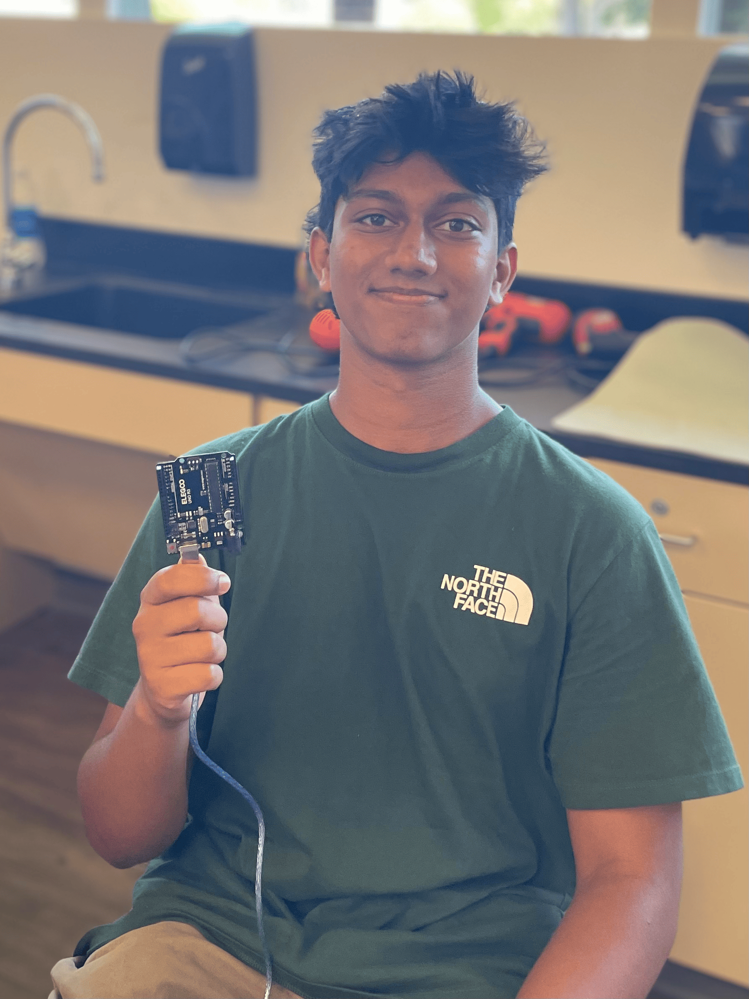
  
# Final Milestone

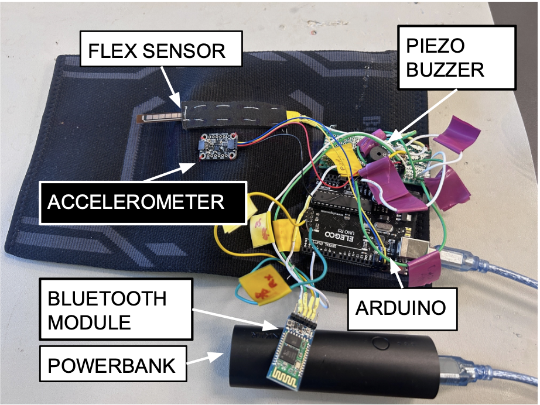
<p><i>Figure 8; Final Project - This is is a picture of my final project with the main componenets labeled</i></p
                                                                                                                 
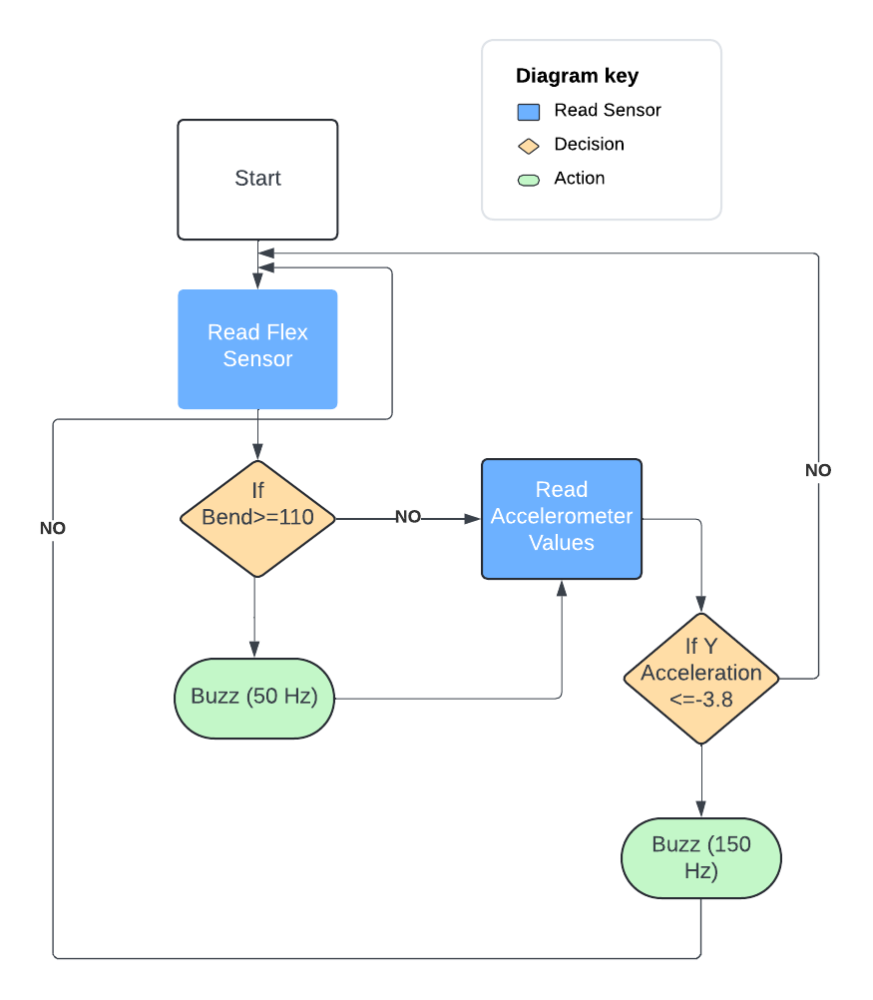

<p><i>Figure 9; Flowchart of My Code - This is flowchart goes through how my code works step by step</i></p>
<!---**Don't forget to replace the text below with the embedding for your milestone video. Go to Youtube, click Share -> Embed, and copy and paste the code to replace what's below.**-->

<iframe width="560" height="315" src="https://www.youtube.com/embed/x8ZHpPgjGdM?si=cjnFPUpM2n6mxZ55" title="YouTube video player" frameborder="0" allow="accelerometer; autoplay; clipboard-write; encrypted-media; gyroscope; picture-in-picture; web-share" referrerpolicy="strict-origin-when-cross-origin" allowfullscreen></iframe>

<!---For your final milestone, explain the outcome of your project. Key details to include are:
- What you've accomplished since your previous milestone
- What your biggest challenges and triumphs were at BSE
- A summary of key topics you learned about
- What you hope to learn in the future after everything you've learned at BSE-->

<p> For my third and final milestone, my project detects bad squat form. Specifically, when someone’s knee bends side to side, the buzzer produces a different noise than when a squat is too deep. See figure 9 for a flowchart of my code!</p>
<p>To sense the side to side movement, I used an accelerometer. An accelerometer measures translational acceleration in three axes: the X-axis, the Y-axis, the Z-axis (See Figure 3 for example of the axes)</p>
<p>The main form of movement during a squat is the X-axis, and the side to side movement (my knees moving side to side) is in the Y-axis. Therefore, if there’s a lot of side-to-side movement sensed, I categorize as a bad squat. This data is smoothed over time to get a clean signal since there was a lot of noise in the sensor.</p>
<p>My first goal was to track the data of squat form. To do this, I used the serial plotter on Arduino IDE to graph my data in real time while wearing on the knee sleeve. I ran into a minor issue here, where the data would not plot. After some research, I found that there couldn’t be any text attached to the data for it to print. After removing the text code, I was able to use the serial plotter.</p>


<i><p>Figure 10; Arduino Serial Plotter - This is a side by side comparison of the knee movement of a good squat vs a bad squat. The one on top is a bad squat, and the y value drops below -3.8, which is the threshold for how much your knee should bend in while squatting. The one below is a good squat, and the y values do not drop below -3.8.</p></i>

<p>When reviewing the data, I noticed that the patterns of the good squat form and the bad squat form on the serial plotter looked almost the same, and it would be very difficult to tell the difference. </p>
<p>After seeing this, I realized that the accelerometer I was using, the MPU6050, was the problem. Its data was very inaccurate with lots of noise and spikes, and it also collected data and reacted very slowly. I decided to replace it with a new accelerometer, the LSM6DS3 + LIS3MDL from Adafruit.</p>

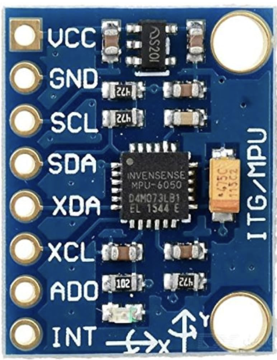

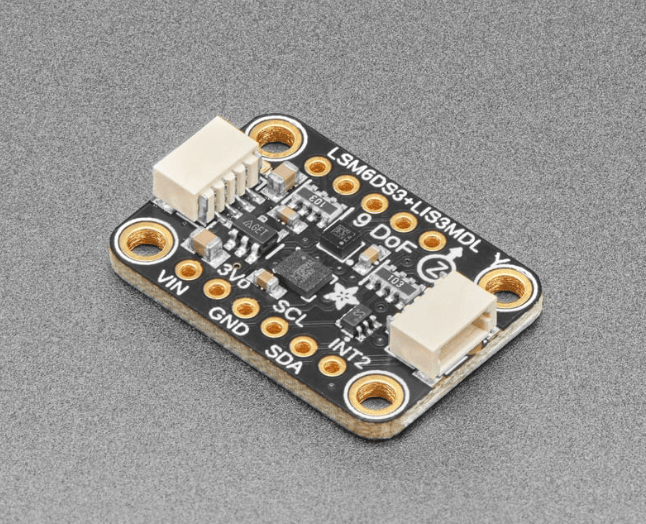

<p><i>Figure 11; <a href="https://www.amazon.com/Axis-Accelerometer-Gyroscope-Sensor-Quadcopter/dp/B06XDBFDM5">MPU6050 Module 3 Axis Accelerometer Gyroscope GY-521 Analog Gyro Sensors Breakout Board for Quadcopter Arduino Robotics Raspberry Pi Boards</a> and <a href="https://learn.adafruit.com/adafruit-lsm6ds3tr-c-lis3mdl-precision-9-dof-imu/overview">Adafruit LSM6DS3TR-C + LIS3MDL - Precision 9 DoF IMU</a>- This is a side by side comparison of the two accelerometers</i></p>

<p>I found some code for the new accelerometer, and copied that, and then I coded it so that the buzzer would produce a tone when my knee bent in. </p>
<p>The new accelerometer still had some noise and spikes in the data, so to fix this I learned about sampling the data.</p> 

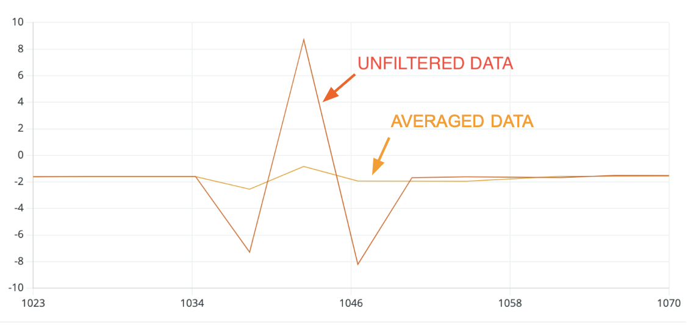
<p><i>Figure 12; Arduino Serial Plotter - I simulated noise in this graph. Because the spike was so fast, it didn't increase the average of the samples over time</i></p>

<p>Sampling is when you take a piece of data at evenly spaced intervals to see something about the total data. In my case, I used the samples to get an average of the data in the Y-axis every second, and then I coded it so that if the average is less than the threshold, (which is the point where my knees bend in), the buzzer goes off.</p>

<p>This snippet of code ensures even sampling</p>

```c++
void loop() {
beginTime = millis();
//all the rest of my code

TimeTook = millis()-beginTime;
 Serial.println(TimeTook);
 delay(150-TimeTook); //ensures sampling at 150ms
}
```
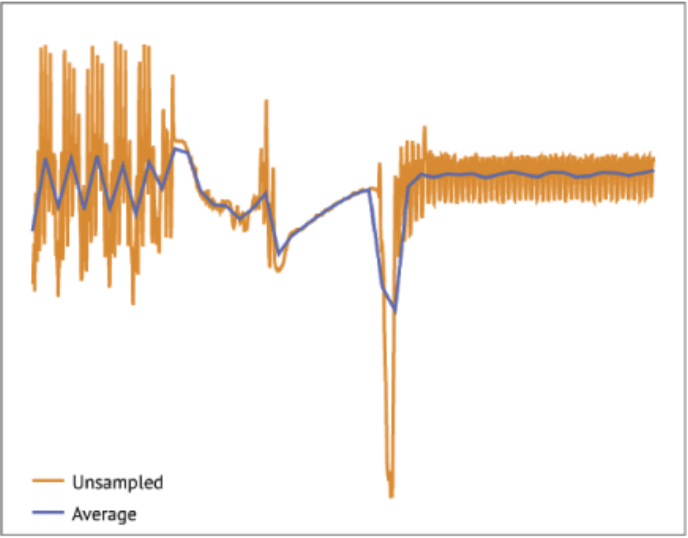
<p><i>Figure 13; <a href="https://www.datylon.com/blog/line-charts-sampling-time-series-data-sets">Line charts & sampling time series data sets</a> - This is how sampling works. There is a lot of noise, but by taking samples and getting an average you can get eliminate most of the noise</i></p>
  
<p>This works because even if there is a spike in the data, the average of the data per second will still be about the same. But, when there is an actual change in the y axis, (my knees), the average will go down and will cause the buzzer to go off. </p>
<p>I coded the Arduino to take samples and make an average of the Y-axis data, but the new code made it so that the data would not print on the serial monitor. To solve the issue, I increased the baud rate and the data started printing again. The issue was that the bluetooth module could only communicate with the baud rate of 9600, which was much lower than what I previously increased it to. </p>
<p>To fix this issue, I had to change the delay of the void loop in the code, and I also increased the number of samples taken per second and the data started to print again at a baud rate of 9600. </p>
<p>After this, I can connect to bluetooth and still print data, and my buzzer will only go off if I squat too deep, (because of the flex sensor), or if my knees bend inward, (accelerometer). This meant that my main project was complete!</p>

<p>Next, I will be working on my modifications. I am planning on doing an exoskeleton modification, which will help the strength of the user of the knee sleeve. It will be mainly hardware based. </p>

# Second Milestone

<iframe width="745" height="419" src="https://www.youtube.com/embed/CIAtUQvTl04" title="Arjun V.  Second Milestone" frameborder="0" allow="accelerometer; autoplay; clipboard-write; encrypted-media; gyroscope; picture-in-picture; web-share" referrerpolicy="strict-origin-when-cross-origin" allowfullscreen></iframe>

<p>My second milestone was to add bluetooth to my Arduino, so it could display data on the serial monitor without having to be connected, adding a powerbank to power the whole thing, and then soldering it and attaching it to my knee sleeve.</p>

<p>My first step was to attach bluetooth to my Arduino. I wired it to the breadboard and Arduino, and connected it to my computer. I wired VCC to +5V, Ground to GND, TX to RX and RX to TX on the Arduino. TX means transmitter, and RX means receiver, so when wiring, the receiver of the one device goes to the other device’s transmitter. If you connected TX to TX, then there would be no way to receive the transmitted data. How the module itself works is by connecting to another device by emitting low-energy radio waves. The reason for adding this to the project was so I could see the flex sensor and accelerometer data without having to use a wired connection, making the project overall more useful.</p>

<p>At this point, I also had to add the power bank so the whole project could be powered without being connected to my computer. The power bank I used was the Anker PowerCore. It has more than enough capacity (5000 mAh) so it can power the device for 100 hours. This way I could connect my bluetooth to see if the data would print without a wired connection.</p>

<p>One of my challenges was that I wasn’t able to connect to my computer with the HC05. In the room, many people used the same bluetooth module, so the first obstacle was even connecting to the module that was mine. For half the day, I connected to all the modules, have none of them connect to my computer, then have to forget all of them and re-pair all of them again.</p>

<p>After pairing to one module, mine began to blink which indicated it was paired. After that I named the module “arjun HC05” in the device settings of my Mac. Now, the data would print on the serial monitor.</p>

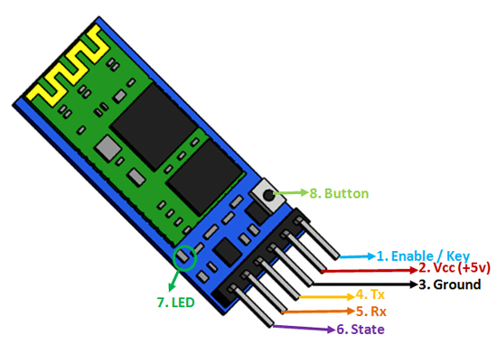

<p><i>Figure 5; <a href="https://components101.com/wireless/hc-05-bluetooth-module">Components 101, HC-05 - Bluetooth Module</a> -  This image shows where the wires go on the HC05</i></p>

<p>After I attached the bluetooth module, all my components were attached and working. This meant I could solder everything so it was permanently connected. I got a new proto board, and began adding the components and soldering it from underneath it. The proto-board helped reduce the overall size of the project, making it more functional. Aside from a few minor mistakes, I got all the wires and components soldered onto the proto board, and now I just needed to test if everything still worked. The type of wire I chose to use for this was solid-core wire, and I made this choice because it would be easier to solder onto the proto board, and the higher degree of flexibility stranded-core wire offered was not required. One thing I learned to do while wiring was labeling my wire. This would save a lot of time in the future over confusion over which wire goes where.</p>

<p>When soldering, I accidentally put a wire connected to the piezo buzzer that was supposed to be connected to digital port 2 to the 5v area. This caused the buzzer to constantly be on at a really high pitch whenever it was connected to power. However, this was a simple fix. I simply had to melt the solder that was on that wire and remove it with the solder sucker, and put it into the right port. Then, everything worked fine.</p>

<p>After this, I attached everything to the knee sleeve. This part was simple, but tedious. I learned how to sew, and then I attached the parts one by one. First, I attached the proto board with all the wires on it, and I sewed the arduino next to it. After those two, I sewed the bluetooth module and accelerometer in place so they would not move around anymore.</p>
  
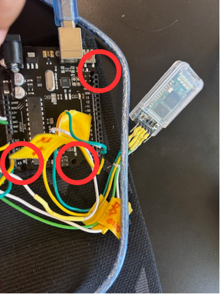

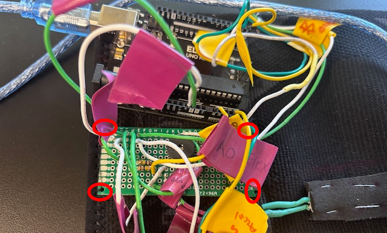

<p>Figure 6; The circled holes are where I sewed the arduino down</p>

<p>Then, the problem of how I would attach the flex sensor to the knee sleeve. The problem was that the knee sleeve stretched a lot when it was worn, so if I just put the flex sensor on the sleeve there was a risk of it breaking while the knee sleeve wanted to stretch. To combat this risk, I utilized a strip of neoprene fabric and put it over the sensor, sort of forming a tube for the sensor to fit in. This solved my issue because it let the flex sensor slide around as much as it wanted to, but it also held it down tight enough so I could measure its bend.</p>

<p>Next, I will finish Milestone 3, in which I will make it so that the Arduino will be able to make the buzzer buzz when the accelerometer detects bad squat form. For example, if your knees bend inward, the accelerometer could read that position and tell the Arduino to make the buzzer buzz. I am looking forward to this because when I had a leg injury, something that told me when my knee was bent inward would have been very helpful.</p>


# First Milestone

<iframe width="560" height="315" src="https://www.youtube.com/embed/Q6NsCcsk8Xg?si=JDRZV4ocUAxqacnu" title="YouTube video player" frameborder="0" allow="accelerometer; autoplay; clipboard-write; encrypted-media; gyroscope; picture-in-picture; web-share" referrerpolicy="strict-origin-when-cross-origin" allowfullscreen></iframe>

<p>My first milestone was to detect position using a flex sensor and accelerometer. My first step was to create a circuit with a flex sensor and two resistors. First, I looked at a 
<a href="https://learn.sparkfun.com/tutorials/flex-sensor-hookup-guide/all">schematic</a>
that called for a 47k resistor, and a 50k resistor was the closest round number to 47k. As there were no 50k resistors, I learned about resistors wired in parallel to fix this issue. Since the current has more ways to flow through the circuit, there is less resistance overall. Due to this, I ended up putting two 100k resistors in parallel to each other to fix this, because when you put the two resistors in the parallel resistor formula (1/Rt = 1/R1 + 1/R2), the total resistance of the two ends up being 50k.</p>
<p>After resolving my resistor issue, I had to learn how flex sensors work. I learned that the flex sensor has ink that has conductive particles in it, and the more the sensor bends the more resistance is measured across it.</p>
 


<p></p><i>Figure 1; <a href="https://learn.sparkfun.com/tutorials/flex-sensor-hookup-guide/all">Spark Fun, Flex Sensor Hookup Guide</a> - This graphic describes how a flex sensor has more resistance when it is bent.</i>

<p></p>The flex sensor is essentially a variable resistor. The problem is that an Arduino reads voltage. We can fix that by putting the flex sensor in a voltage divider circuit,then use the resistance that the flex sensor gives, use Ohm's law and find the voltage of it, which is something the Arduino can actually read. For example, if we take the formula V<sub>out</sub> = V<sub>in</sub> &times; ( R<sub>2</sub> / ( R<sub>1</sub> + R<sub>2</sub> ) ), and say the flex sensor is R<sub>2</sub>, if the resistance of it increases so does the V<sub>out</sub>. Therefore, if the flex sensor bends more and the resistance increases, so does the voltage out which the arduino reads.

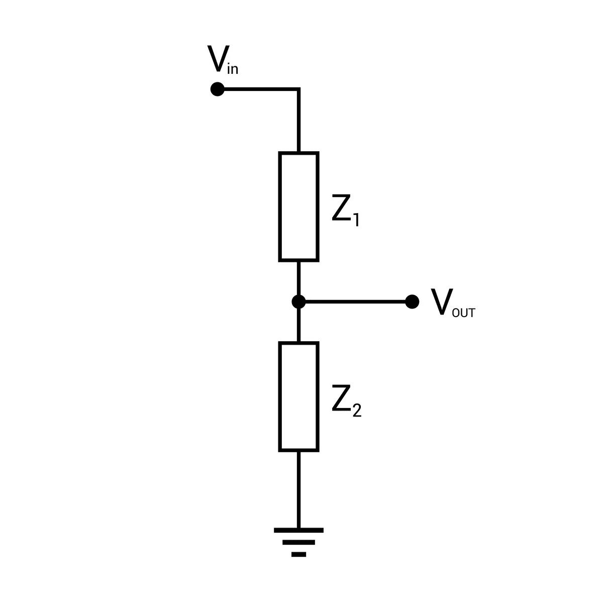

<i><p>Figure 2; <a href="https://resources.pcb.cadence.com/blog/voltage-dividers-operations-and-functions">Voltage Dividers: Operations and Functions</a> - This is a voltage divider circuit. For my project, Z2 would be the Flex sensor and Z1 would be the parallel resistors I talked about earlier.</i></p>

<p></p>This can be interpreted into the degrees the sensor is bending with some code. In the code, the flex sensor gives a value of 0 - 1023, then it is normalized. I calibrated the resistance for 0 degrees and 90 degrees, with STRAIGHT_RESISTANCE (0 degrees) being 13304.4 ohms and BEND_RESISTANCE (90 degrees) being 31319.56 using the map() function in the Arduino IDE. The function extrapolates the degree value to a different bend. Also, the flex sensor also can only be plugged into analog instead of digital because it has multiple values. When the sensor bends past 110 degrees, the buzzer goes off, which is the most your knees should bend when squatting.

<p></p>Next, I added the accelerometer. I found a way to display the position of the accelerometer on the serial monitor of the Arduino IDE using the Serial.print()function. After some research, I found the code and put that into the Arduino sketch with the flex sensor code. Next, I wired the accelerometer to the Arduino.

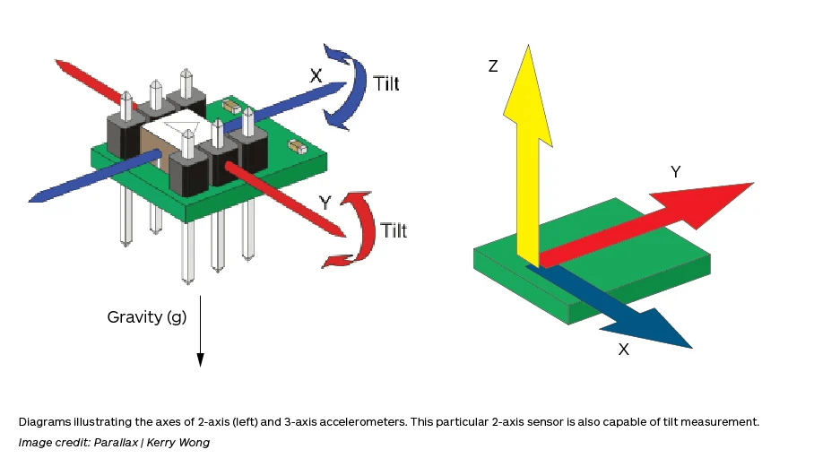

<p><i>Figure 3; <a href="https://insights.globalspec.com/article/1263/specifying-an-accelerometer-function-and-applications">GlobalSpec, Specifying an Accelerometer: Function and Applications</a> -  This is how a accelerometer works.</i></p>

<p></p>Some challenges I had were that I had to learn about parallel resistors to solve my resistor issue. This concept took me two days to grasp, but once I learned it it made my understanding of the circuit much better. I also had to learn how to get data from an accelerometer. I had no idea how to code this, but I was able to find some code online which made adding to my code much easier.
Up next is my second milestone. I plan on attaching the bluetooth module, so I can track the data from the accelerometer and flex sensor much easier.

# Schematics 
<i>Figure 4</i>; Milestone 1 Schematic - 
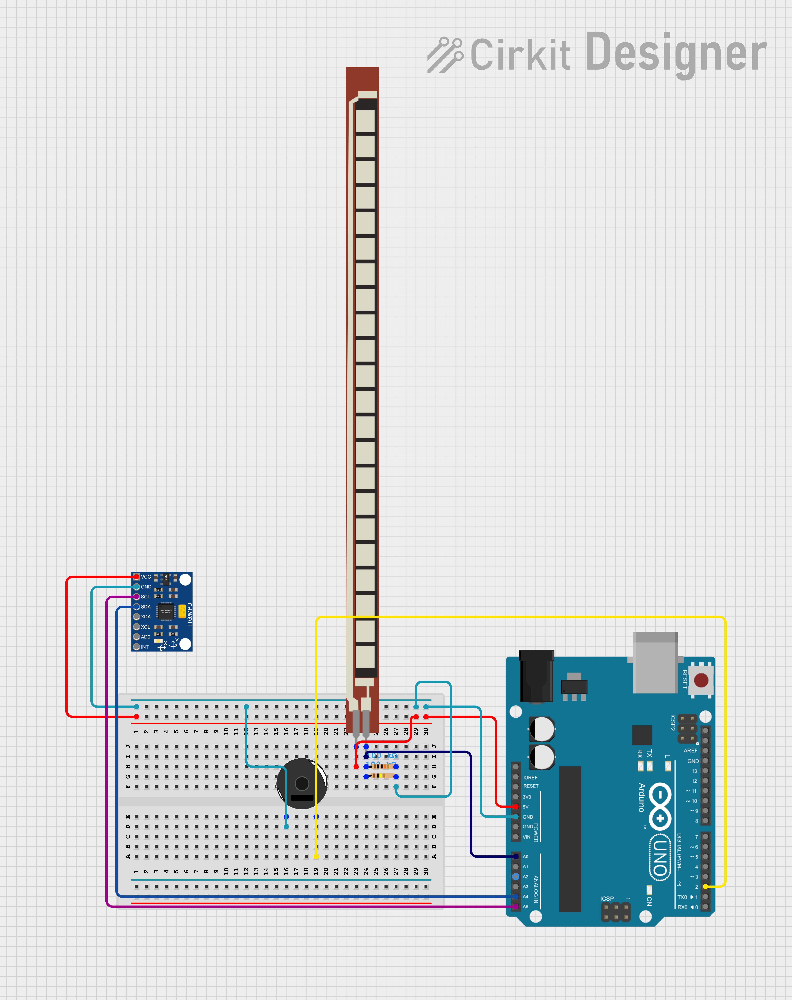

<i>Figure 7</i>; Milestone 2 Schematic (Breadboard is supposed to be proto board, simply solder components onto proto board how breadboard is wired) -
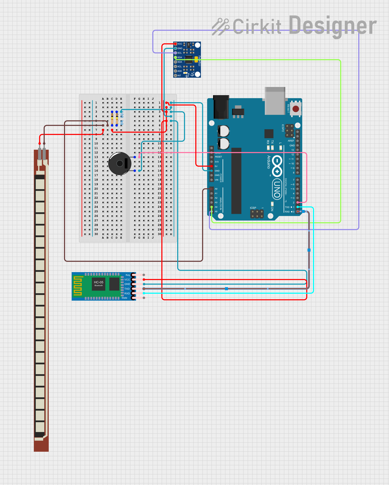

# Code
```c++
// Basic demo for accelerometer/gyro readings from Adafruit LSM6DS3TR-C

#include <Adafruit_LSM6DS3TRC.h>

// For SPI mode, we need a CS pin
#define LSM_CS 10
// For software-SPI mode we need SCK/MOSI/MISO pins
#define LSM_SCK 13
#define LSM_MISO 12
#define LSM_MOSI 11

Adafruit_LSM6DS3TRC lsm6ds3trc;

const int FLEX_PIN = A0; // Pin connected to voltage divider output
const int buzzerPin = 2;
// Measure the voltage at 5V and the actual resistance of your
// 47k resistor, and enter them below:
const float VCC = 4.98; // Measured voltage of Ardunio 5V line
const float R_DIV = 50000.0; // Measured resistance of 3.3k resistor

// Upload the code, then try to adjust these values to more
// accurately calculate bend degree.
const float STRAIGHT_RESISTANCE = 10604.27; // resistance when straight
const float BEND_RESISTANCE = 13875.84; // resistance at 90 deg

const float ACCEL_THRESHOLD = 3.8; // Threshold for accelerometer (in m/s^2)

const int NUM_SAMPLES = 6; // Number of samples for moving average
float accelYBuffer[NUM_SAMPLES];
int sampleIndex = 0;
int beginTime = 0;
int TimeTook = 0;

void setup(void) {

Serial.begin(9600);
  pinMode(FLEX_PIN, INPUT);
  pinMode(buzzerPin, OUTPUT);

  Serial.begin(9600);
  while (!Serial)
    delay(10); // will pause Zero, Leonardo, etc until serial console opens

  Serial.println("Adafruit LSM6DS3TR-C test!");

  if (!lsm6ds3trc.begin_I2C()) {
    // if (!lsm6ds3trc.begin_SPI(LSM_CS)) {
    // if (!lsm6ds3trc.begin_SPI(LSM_CS, LSM_SCK, LSM_MISO, LSM_MOSI)) {
    Serial.println("Failed to find LSM6DS3TR-C chip");
    while (1) {
      delay(10);
    }
  }

  Serial.println("LSM6DS3TR-C Found!");

  // lsm6ds3trc.setAccelRange(LSM6DS_ACCEL_RANGE_2_G);
  Serial.print("Accelerometer range set to: ");
  switch (lsm6ds3trc.getAccelRange()) {
  case LSM6DS_ACCEL_RANGE_2_G:
    Serial.println("+-2G");
    break;
  case LSM6DS_ACCEL_RANGE_4_G:
    Serial.println("+-4G");
    break;
  case LSM6DS_ACCEL_RANGE_8_G:
    Serial.println("+-8G");
    break;
  case LSM6DS_ACCEL_RANGE_16_G:
    Serial.println("+-16G");
    break;
  }

  // lsm6ds3trc.setGyroRange(LSM6DS_GYRO_RANGE_250_DPS);
  Serial.print("Gyro range set to: ");
  switch (lsm6ds3trc.getGyroRange()) {
  case LSM6DS_GYRO_RANGE_125_DPS:
    Serial.println("125 degrees/s");
    break;
  case LSM6DS_GYRO_RANGE_250_DPS:
    Serial.println("250 degrees/s");
    break;
  case LSM6DS_GYRO_RANGE_500_DPS:
    Serial.println("500 degrees/s");
    break;
  case LSM6DS_GYRO_RANGE_1000_DPS:
    Serial.println("1000 degrees/s");
    break;
  case LSM6DS_GYRO_RANGE_2000_DPS:
    Serial.println("2000 degrees/s");
    break;
  case ISM330DHCX_GYRO_RANGE_4000_DPS:
    break; // unsupported range for the DS33
  }

  // lsm6ds3trc.setAccelDataRate(LSM6DS_RATE_12_5_HZ);
  Serial.print("Accelerometer data rate set to: ");
  switch (lsm6ds3trc.getAccelDataRate()) {
  case LSM6DS_RATE_SHUTDOWN:
    Serial.println("0 Hz");
    break;
  case LSM6DS_RATE_12_5_HZ:
    Serial.println("12.5 Hz");
    break;
  case LSM6DS_RATE_26_HZ:
    Serial.println("26 Hz");
    break;
  case LSM6DS_RATE_52_HZ:
    Serial.println("52 Hz");
    break;
  case LSM6DS_RATE_104_HZ:
    Serial.println("104 Hz");
    break;
  case LSM6DS_RATE_208_HZ:
    Serial.println("208 Hz");
    break;
  case LSM6DS_RATE_416_HZ:
    Serial.println("416 Hz");
    break;
  case LSM6DS_RATE_833_HZ:
    Serial.println("833 Hz");
    break;
  case LSM6DS_RATE_1_66K_HZ:
    Serial.println("1.66 KHz");
    break;
  case LSM6DS_RATE_3_33K_HZ:
    Serial.println("3.33 KHz");
    break;
  case LSM6DS_RATE_6_66K_HZ:
    Serial.println("6.66 KHz");
    break;
  }

  // lsm6ds3trc.setGyroDataRate(LSM6DS_RATE_12_5_HZ);
  Serial.print("Gyro data rate set to: ");
  switch (lsm6ds3trc.getGyroDataRate()) {
  case LSM6DS_RATE_SHUTDOWN:
    Serial.println("0 Hz");
    break;
  case LSM6DS_RATE_12_5_HZ:
    Serial.println("12.5 Hz");
    break;
  case LSM6DS_RATE_26_HZ:
    Serial.println("26 Hz");
    break;
  case LSM6DS_RATE_52_HZ:
    Serial.println("52 Hz");
    break;
  case LSM6DS_RATE_104_HZ:
    Serial.println("104 Hz");
    break;
  case LSM6DS_RATE_208_HZ:
    Serial.println("208 Hz");
    break;
  case LSM6DS_RATE_416_HZ:
    Serial.println("416 Hz");
    break;
  case LSM6DS_RATE_833_HZ:
    Serial.println("833 Hz");
    break;
  case LSM6DS_RATE_1_66K_HZ:
    Serial.println("1.66 KHz");
    break;
  case LSM6DS_RATE_3_33K_HZ:
    Serial.println("3.33 KHz");
    break;
  case LSM6DS_RATE_6_66K_HZ:
    Serial.println("6.66 KHz");
    break;
  }

  lsm6ds3trc.configInt1(false, false, true); // accelerometer DRDY on INT1
  lsm6ds3trc.configInt2(false, true, false); // gyro DRDY on INT2

 for (int i = 0; i < NUM_SAMPLES; i++) {
    accelYBuffer[i] = 0;
  }
}
void loop() {

  beginTime = millis(); //used for finding how long code takes to run

 // Read the ADC, and calculate voltage and resistance from it
  int flexADC = analogRead(FLEX_PIN);
  float flexV = flexADC * VCC / 1023.0;
  float flexR = R_DIV * (VCC / flexV - 1.0);
  Serial.println("Resistance: " + String(flexR) + " ohms");

  // Use the calculated resistance to estimate the sensor's
  // bend angle:
  float angle = map(flexR, STRAIGHT_RESISTANCE, BEND_RESISTANCE,
                   0, 90.0);
  Serial.println("Bend: " + String(angle) + " degrees");
  Serial.println();

  //delay(500);

  if (angle >= 110) {
  tone(buzzerPin,50);
  } else {
    noTone(buzzerPin);
  }


  // Get a new normalized sensor event
  sensors_event_t accel;
  sensors_event_t gyro;
  sensors_event_t temp;
  lsm6ds3trc.getEvent(&accel, &gyro, &temp);

  /* Display the results (acceleration is measured in m/s^2) */
  Serial.print("\t\tAccel X: ");
  Serial.print(accel.acceleration.x);
  Serial.print(" \tY: ");
  Serial.print(accel.acceleration.y);
  Serial.print(" \tZ: ");
  Serial.print(accel.acceleration.z);
  Serial.println(" m/s^2 ");

  // Add new reading to buffer and update sample index
  accelYBuffer[sampleIndex] = accel.acceleration.y;
  sampleIndex = (sampleIndex + 1) % NUM_SAMPLES;

  // Calculate moving average of Y-axis accelerometer data
  float avgAccelY = 0;
  for (int i = 0; i < NUM_SAMPLES; i++) {
    avgAccelY += accelYBuffer[i];
  }
  avgAccelY /= NUM_SAMPLES;
  
  Serial.print(avgAccelY);
  Serial.print(",");

  // Check accelerometer threshold on averaged Y-axis data
  if (avgAccelY <= -ACCEL_THRESHOLD) {
    tone(buzzerPin, 150);
  } else {
    noTone(buzzerPin);
  }


  TimeTook = millis()-beginTime;
  Serial.println(TimeTook);
  delay(150-TimeTook);

}


  //  // serial plotter friendly format

  //  Serial.print(temp.temperature);
  //  Serial.print(",");

  //  Serial.print(accel.acceleration.x);
  //  Serial.print(","); Serial.print(accel.acceleration.y);
  //  Serial.print(","); Serial.print(accel.acceleration.z);
  //  Serial.print(",");

  // Serial.print(gyro.gyro.x);
  // Serial.print(","); Serial.print(gyro.gyro.y);
  // Serial.print(","); Serial.print(gyro.gyro.z);
  // Serial.println();
  //  delayMicroseconds(10000);

 
}

```

# Bill of Materials
Here's where you'll list the parts in your project. To add more rows, just copy and paste the example rows below.
Don't forget to place the link of where to buy each component inside the quotation marks in the corresponding row after href =. Follow the guide [here]([url](https://www.markdownguide.org/extended-syntax/)) to learn how to customize this to your project needs. 

| **Part** | **Note** | **Price** | **Link** |
|:--:|:--:|:--:|:--:|
| Arduino Uno R3 | Microcontoller | $13 | <a href="https://www.amazon.com/ELEGOO-Controller-ATmega328P-CompatibleArduino/dp/B0B6VV7MS7/ref=asc_df_B0B6VV7MS7/?tag=hyprod20&linkCode=df0&hvadid=692875362841&hvpos=&hvnetw=g&hvrand=2388022148290709767&hvpone=&hvptwo=&hvqmt=&hvdev=c&hvdvcmdl=&hvlocint=&hvlocphy=9032183&hvtargid=pla-2281435180738&psc=1&mcid=e0097333ec013ec0a6c874e637b79075&hvocijid=2388022148290709767-B0B6VV7MS7-&hvexpln=73&gad_source=1"> Link </a> |
| BodyProx Knee Sleeve | Keeps All Components on Knee | $15 | <a href="https://www.amazon.com/gp/aw/d/B0987XN6QH/?_encoding=UTF8&pd_rd_plhdr=t&aaxitk=5aed513eac49a60526c6d9777d9d93db&hsa_cr_id=7875900910501&qid=1719864251&sr=1-1-9e67e56a-6f64-441f-a281 df67fc737124&ref_=sbx_be_s_sparkle_mcd_asin_0_mariomsg&pd_rd_w=qsSVr&content-id=amzn1.sym.8591358d-1345-4efd-9d50-5bd4e69cd942%3Aamzn1.sym.8591358d-1345-4efd-9d50-5bd4e69cd942&pf_rd_p=8591358d-1345-4efd-9d50-5bd4e69cd942&pf_rd_r=PA56EJATP874WHNCNE6H&pd_rd_wg=ihoKq&pd_rd_r=388c0a8d-3fca-4ec1-a970-cdcf8c7489c9&th=1"> Link </a> |
| Adafruit Long Flex sensor | Measures Bend of Knee | $18 | <a href="https://www.amazon.com/Adafruit-Long-Flex-sensor-ADA182/dp/B01BNNNS5Q/ref=sr_1_3?crid=1GEOF65S7SCLW&dib=eyJ2IjoiMSJ9.lhZF8xWpz39rDzMy73v TT23Ss_RjBfj1RB7kEAbJ9D0yBHgcKw1YMgsMIaCD6oj4egLyFTXzJPJROjBXBNuLyvP3hfVG8V9B_gtFq3L7mxpoS6d2cm8cA453b16MvFuDDX9kD9oJbk3173icFBHyeg2y1Vvlqp7qWjWgna1VVPTA_OUwnV1JetfY2OnlDWNX90LumgmwPODB1DZMXj6Kx2Tzoz5_4Zp1N0XQmSndWHGVCr9QXxmgB0P2268U5jbYeGzZgUcZSGgiQ8JObtVoiz5yTr6MRas9v0iQbuOp6U.q-rFWTMu_qQemed_1UjkLOc3NMOPC5JBJq03fSe7z5M&dib_tag=se&keywords=flex+sensor&qid=1719864423&s=industrial&sprefix=flex+sensor%2Cindustrial%2C138&sr=1-3"> Link </a> |
| Shillehtek MPU6050 | Accelerometer/Gyroscope | $10| <a href="https://www.amazon.com/Pre-Soldered-Accelerometer-Raspberry-Compatible-Arduino/dp/B0BMY15TC4/ref=sr_1_2_sspa?crid=CM7TEBWH5LIO&dib=eyJ2IjoiMSJ9.nQ-HfKOFyZoszrV3cxLK6tLh71T4Dx8jkRlVGhGj_VwMCeIYm-9LTdm85DpoJu1zh0nywPtx4TH5RhL8Z-Dze2fKh6NQv4hdiCWU70ldzvGRL0cRXElTh8IXOK45Kve48uzqOfYj4xRcReIj9blNK7ouqQJZkUzzGQP-Z4T4d34sV47Q78cE0ftOXOwW59uY_WEA2LdPn6S9FBtO29E9Kr-oWRQQg2XawN6RWeAWLrwyeMVOSFCFbOH8elVhz2Y6ewiAfOcbz70dHT_pC_78tWQrrrW7UdHvmuhcLSkrWhk.zaJyxNlLDGbpF6KYhgewIzE7xs7HMFwbHXO3tCVeyrA&dib_tag=se&keywords=mpu6050&qid=1719864499&s=industrial&sprefix=mpu6050%2Cindustrial%2C169&sr=1-2-spons&sp_csd=d2lkZ2V0TmFtZT1zcF9hdGY&psc=1"> Link </a> |
| Piezo Buzzer | Alerts User of Incorrect Form | $6 | <a href="https://www.amazon.com/Cylewet-Terminals-Electronic-Electromagnetic-Impedance/dp/B01NCOXB2Q/ref=sr_1_6?crid=2LHY512NYTX03&dib=eyJ2IjoiMSJ9.v9xp9jV7C-sQT7j4p0UIV_xVKzU8DDa55Zy7nzfVmYaimJdByrZMfNvEm2fHDR0za4DaPd8brwiVZEi-IHCgo2sBg8k3EJMcmg-sVR90kJcP9oOf8zSFh1iWZlw1PJrUObynF7hsFTlUl4Mjw1yLhEb5aveIgXUMHiN2P2TdYaKK_yFtrf95J7L5mXjX1oEvZH1Cnvc-xk1Nel5twsTKJkHHc66-oivwv6bs2SLxMd-EUIVOKxL7DltKGCHB1GZoH1BXVwGU2Y8otebOLO8e3y7KD-K5CpOcO4zjO47owcg.r5O90tcYn3TNrCpGtKRJVSosnV60zYqj_ue96Klj1DU&dib_tag=se&keywords=piezo+buzzer&qid=1719864686&s=industrial&sprefix=piezo+buzzer%2Cindustrial%2C134&sr=1-6"> Link </a> |
| 100k Resistors | Increases Resistance in Circut | $7 | <a href="https://www.amazon.com/Cylewet-Terminals-Electronic-Electromagnetic-Impedance/dp/B01NCOXB2Q/ref=sr_1_6?crid=2LHY512NYTX03&dib=eyJ2IjoiMSJ9.v9xp9jV7C-sQT7j4p0UIV_xVKzU8DDa55Zy7nzfVmYaimJdByrZMfNvEm2fHDR0za4DaPd8brwiVZEi-IHCgo2sBg8k3EJMcmg-sVR90kJcP9oOf8zSFh1iWZlw1PJrUObynF7hsFTlUl4Mjw1yLhEb5aveIgXUMHiN2P2TdYaKK_yFtrf95J7L5mXjX1oEvZH1Cnvc-xk1Nel5twsTKJkHHc66-oivwv6bs2SLxMd-EUIVOKxL7DltKGCHB1GZoH1BXVwGU2Y8otebOLO8e3y7KD-K5CpOcO4zjO47owcg.r5O90tcYn3TNrCpGtKRJVSosnV60zYqj_ue96Klj1DU&dib_tag=se&keywords=piezo+buzzer&qid=1719864686&s=industrial&sprefix=piezo+buzzer%2Cindustrial%2C134&sr=1-6"> Link </a> |
| DSD Tech HC-05 Bluetooth Module | Makes Monitor Able to Connect via Bluetooth | $10 | <a href="https://www.amazon.com/DSD-TECH-HC-05-Pass-through-Communication/dp/B01G9KSAF6/ref=sxin_16_pa_sp_search_thematic_sspa?content-id=amzn1.sym.bb5bd4b6-13f8-40e4-93bc-54b5ec1d9a4f%3Aamzn1.sym.bb5bd4b6-13f8-40e4-93bc-54b5ec1d9a4f&crid=ZH7SPS2M4YOW&cv_ct_cx=hc05+bluetooth+module&dib=eyJ2IjoiMSJ9.bSlJf7yGmFdK_yurhnUR1waUYkTrXwtjXCfVVPxX04FMnTul5bQ1fyu1GIC9Q9Cg.dGG2pIBfz8I8cKweIvvcoCi1Dp8AoEVnWBTMpqeJN3g&dib_tag=se&keywords=hc05+bluetooth+module&pd_rd_i=B01G9KSAF6&pd_rd_r=374f2b72-d008-4ebc-8223-472f142a8f69&pd_rd_w=apboR&pd_rd_wg=rlLyo&pf_rd_p=bb5bd4b6-13f8-40e4-93bc-54b5ec1d9a4f&pf_rd_r=3K27SVZJ2ZB65JDVHNJB&qid=1719864907&s=industrial&sbo=RZvfv%2F%2FHxDF%2BO5021pAnSA%3D%3D&sprefix=hc05+%2Cindustrial%2C120&sr=1-1-47f26250-4ef4-4791-82ee-5e64b96b83fb-spons&sp_csd=d2lkZ2V0TmFtZT1zcF9zZWFyY2hfdGhlbWF0aWM&psc=1"> Link </a> |
| Assorted Single-Core Wires | Connections between Components | $15 | <a href="https://www.amazon.com/Electrical-7colors-spools-UL1007-breadboard/dp/B083DN5R61/ref=asc_df_B083DN5R61/?tag=hyprod-20&linkCode=df0&hvadid=692875362841&hvpos=&hvnetw=g&hvrand=8530834579962313816&hvpone=&hvptwo=&hvqmt=&hvdev=c&hvdvcmdl=&hvlocint=&hvlocphy=9032183&hvtargid=pla-2281435179978&psc=1&mcid=8b897963727d312e9a95e09793193a56&hvocijid=8530834579962313816-B083DN5R61-&hvexpln=73&gad_source=1"> Link </a> |


# Other Resources/Examples
<!---One of the best parts about Github is that you can view how other people set up their own work. Here are some past BSE portfolios that are awesome examples. You can view how they set up their portfolio, and you can view their index.md files to understand how they implemented different portfolio components. -->
- [Flex Sensor Hookup Guide](https://learn.sparkfun.com/tutorials/flex-sensor-hookup-guide/all)
- [MPU6050 Sensor Arduino Tutorial](https://www.youtube.com/watch?v=a37xWuNJsQI)
- [Specifying an Accelerometer: Function and Applications](https://insights.globalspec.com/article/1263/specifying-an-accelerometer-function-and-applications)
- [HC-05 - Bluetooth Module](https://components101.com/wireless/hc-05-bluetooth-module)
- [Serial Communication](https://learn.sparkfun.com/tutorials/serial-communication/wiring-and-hardware#:~:text=As%20such%2C%20serial%20devices%20should,other%2C%20and%20vice%2Dversa.)
- [Elegoo Uno R3](https://epow0.org/~amki/car_kit/Datasheet/ELEGOO%20UNO%20R3%20Board.pdf)


# Starter Project

<iframe width="560" height="315" src="https://www.youtube.com/embed/Xf_h2ZlMCag?si=Pgq-o5lSrfOtKBD6" title="YouTube video player" frameborder="0" allow="accelerometer; autoplay; clipboard-write; encrypted-media; gyroscope; picture-in-picture; web-share" referrerpolicy="strict-origin-when-cross-origin" allowfullscreen></iframe>

<p></p>My starter project is a microcontroller-based Arduino project. It buzzes when I press a button and an LED goes off when it detects motion.    
<p></p>There are 5 main components in this project. The parts consist of the Arduino itself, a button, a piezo buzzer, a green LED and a PIR motion sensor. The first input and output is the button and the piezo buzzer. The piezo buzzer works by applying voltage to a piezoelectric ceramic material. The voltage causes the material to deform and vibrate, making sound waves.

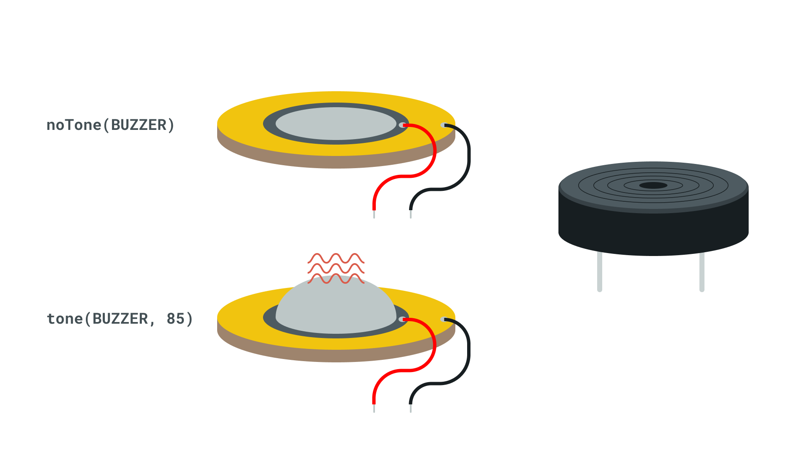
<i>Figure 1</i> ; Photo from Arduino Sensor Kit - The image shows how the buzzer vibrates to produce a tone

<p></p>The button makes the piezo buzzer buzz at a tone of about 50 hz by closing the circuit and allowing the current to flow to the buzzer. 
<p></p>The second input and output are the PIR, or Passive Infrared motion sensor and the LED, or Light Emitting Diodes. A PIR sensor detects infrared radiation. It does this by sensing a heat source’s movements, which cause a pulse which the PIR sensor sends as a signal. When the sensor detects the heat source moving, the Arduino reads it and tells the LED to turn off. The Arduino can have code uploaded to it, and that tells the microcontroller what to do.

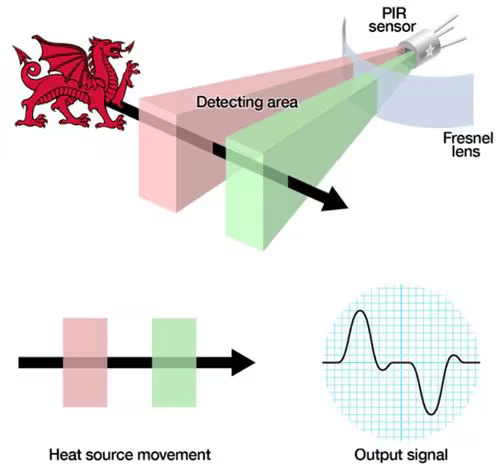
<i><p>Figure 2</i> ; Photo from Adafruit, Lady Ada - The image shows how the signal is generated. The heat sources passes through the detecting area and the PIR sensor registers that.</p>

<p></p>I had a few major challenges, with the biggest one being the difficulty of uploading my code to the Arduino. The port for the Arduino would not show up on the Arduino software. Therefore I could not upload my fixed code. I tried many things to troubleshoot this issue. For example, I tried pressing the reset button on Arduino, removing and reinstalling the software, and even testing the cable and the USB-C adapter, but the issue ended up being more simple. After rewiring the board, I got it working again.
<p></p>Next, I will be working on my main project, the Knee Rehabilitation Monitor. The starter project gave me a good understanding of wiring, coding, and breadboards, so I am looking forward to my main project with this knowledge. The reason I chose my main project is because it looked like a helpful device for people with frequent knee injuries, like athletes or the elderly, and I think making something like the knee rehab monitor will help me find and make other ways to help in the future.

# Starter Project Schematics 

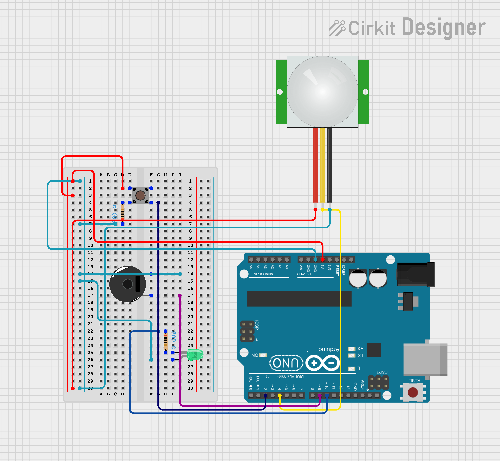
